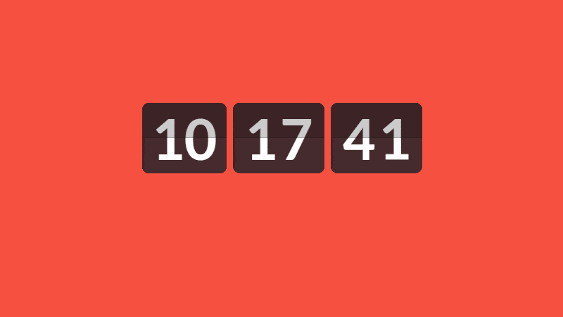

# Relógio Digital🕐

Este é um projeto de um simples *Relógio Digital* desenvolvido utilizando **HTML**, **CSS** e **JavaScript**.💻✨

## 🚀 Tecnologias Utilizadas

- **HTML**: Estrutura básica da página
- **CSS**: Estilos para a aparência da interface,  layout, cores e animações do relógio digital
- **JavaScript**: Lógica para realizar calcular as horas

## 🌐 Acesse Aqui

Você pode acessar  o Jogo da Velha através deste [link](https://marcellofigueiredo.github.io/Relogio-Digital/). Basta abrir no seu navegador e começar a usar!
# Relógio Digital